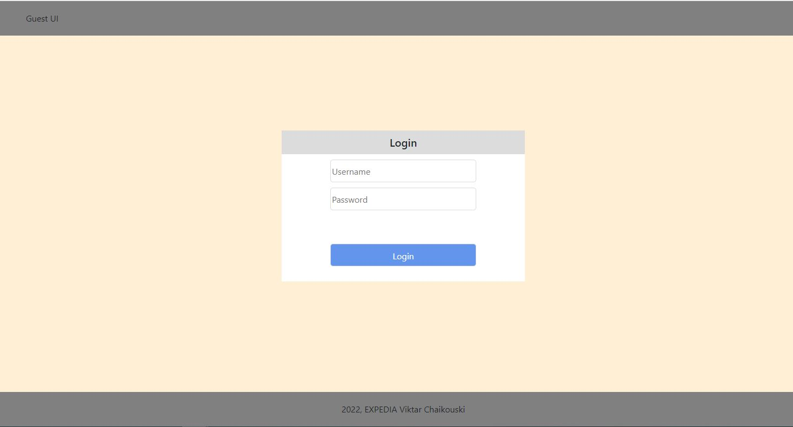
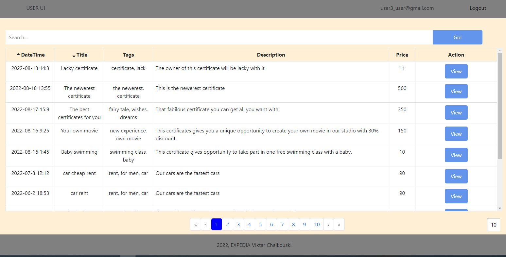
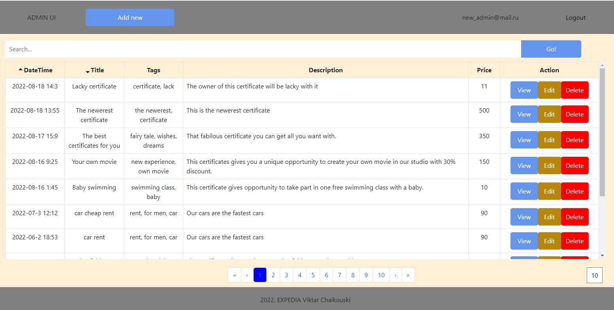
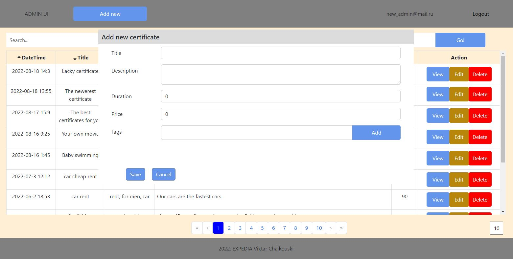
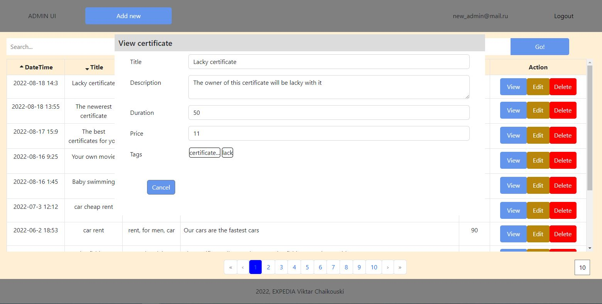
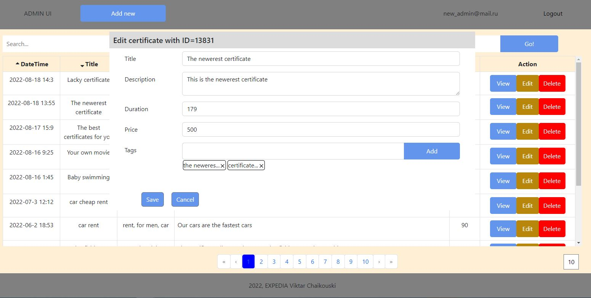
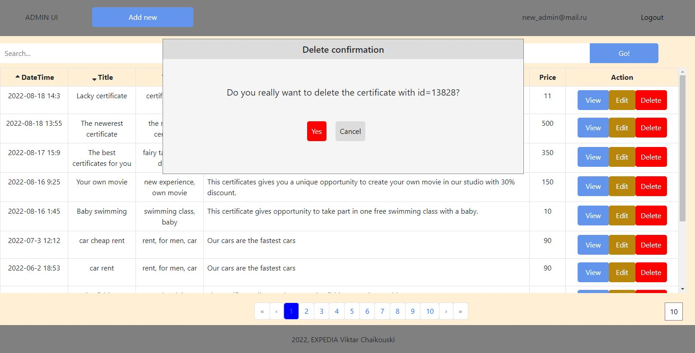

Certificates shop UI.

The UI is created using HTML/CSS, JavaScript and React.

This UI icludes follow pages: 

1. Login page (/login)

2. Certificate list page (/certificates)
The view of this page depends on the user's credentials.

A user page:

An admin page:

Below are several views of popup windows for different action lower:
- add new certificate

- view certificate's details

- edit the certificate

- delete the certificate
